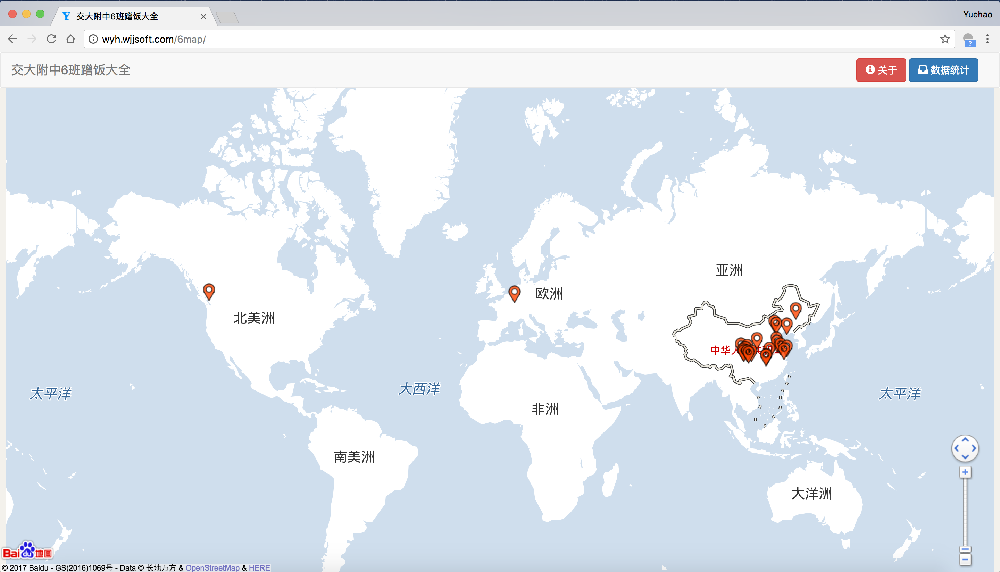
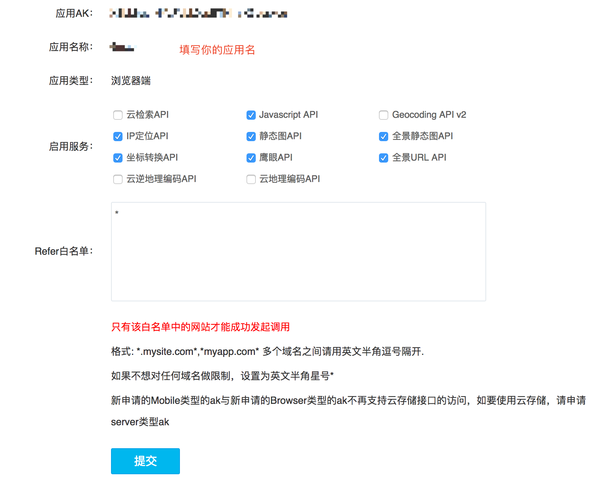

# irmap

## 简介

IRMap (Ideal Reality Map) 是一个用来做高中毕业去向的工具。基于Bootstrap和百度地图。兼容各大主流浏览器，iOS，Android，以及QQ和微信等平台。

以下是示例展示：

- ### 6map



在线地址：[http://yuehaolab.com/apps/6map/](http://yuehaolab.com/apps/6map/)


## 如何使用？

你只用在index.html中添加你的百度地图AK码以及更改config.js文件里的内容就能完成整个地图的生成。

### 获取百度地图开放平台AK码

关于如何获取百度地图AK码，其实很简单，直接去[百度地图开放平台](http://lbsyun.baidu.com/)里点击“申请密钥”，然后填写一个申请表。申请表比照下图填写，填写之后提交就能获取AK码了：



用文本编辑器打开index.html，将这个密钥填写在index.html的下图所示位置并保存文件：

```html
<script type="text/javascript" src="http://api.map.baidu.com/api?v=2.0&ak=亲，密钥填这里"></script>
```

注意：如果你的发布平台支持HTTPS协议，请将上面链接中"http"部分改为"https"。

### 更改config.js

之后更改config.js。示例如下：

```javascript
var MAP_STYLE = "hardedge";

var DATA = {
	"城市1" : {
		"大学A" : ["Peter", "Mary"],
		"大学B" : ["Tony", "Pepper"]
	},

	"城市2" : {
		"大学C" : ["Stephen", "Klay", "Kevin"],
		"大学D" : ["Lebron"]
	}
};

var SPEC_POS = {
	"大学C" : [121.597479, 31.185356]
};

var MAP_TITLE = "毕业去向";

var ABOUT = {
	"作者" : ["Yuehao"],
	"框架" : ["irmap", "Bootstrap", "百度地图"]
};
```

这个文件会被自动引进项目中，所以不要更改这个文件的名字和位置，其中定义的变量将会在项目中被使用。以下介绍其中定义的变量：

- MAP_STYLE 地图样式，参考[样式列表](http://developer.baidu.com/map/custom/list.htm)。
- DATA 学校数据，[JSON](http://www.json.org/json-zh.html)格式。格式参考上面的示例。地图上的地标根据这个变量里的内容自动定位。
- SPEC_POS 一些学校（比如国外的学校）的位置百度地图无法通过搜索定位，或者定位有误，更改这个属性可以设置学校的经纬度从而辅助定位。（百度地图开放平台提供了一个拾取经纬度的工具，见[百度地图坐标拾取系统](http://api.map.baidu.com/lbsapi/getpoint/index.html)）
- MAP_TITLE 地图标题。
- ABOUT 关于界面中的内容。格式：`{"标题" : ["第一行内容", "第二行内容"]}`。

更改完成后，保存config.js文件，用浏览器打开index.html就能看到结果。

## 发布地图

推荐使用Github Pages发布你所制作完成的地图。你也可以使用自己的服务器，并以静态页面的形式发布地图。

## 开源协议

GPL协议（协议详情见：[维基百科](https://en.wikipedia.org/wiki/GNU_General_Public_License)）
